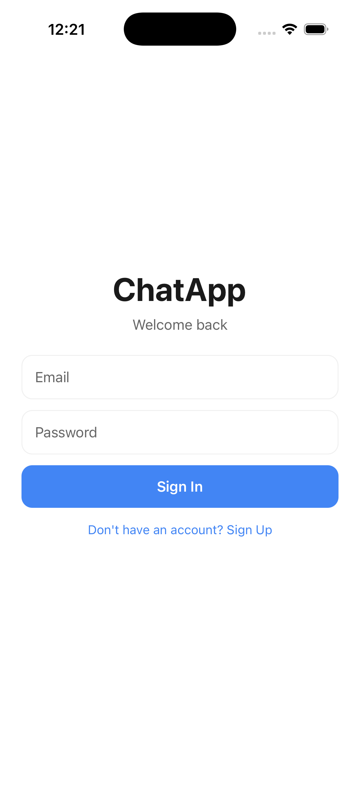
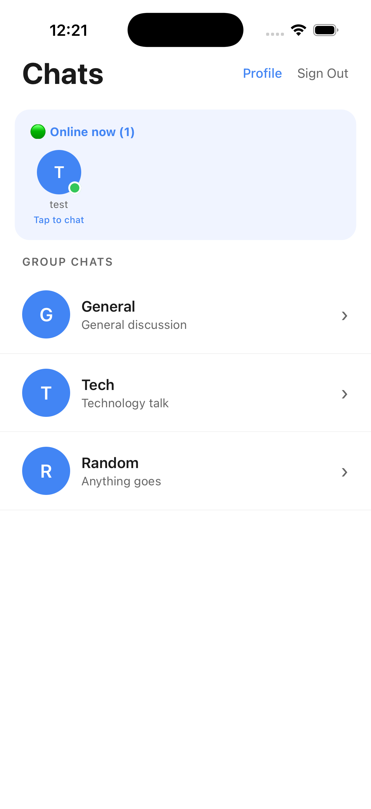
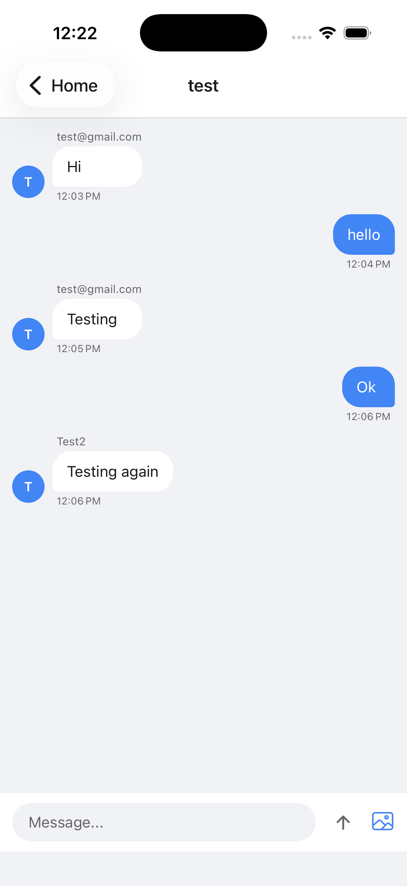
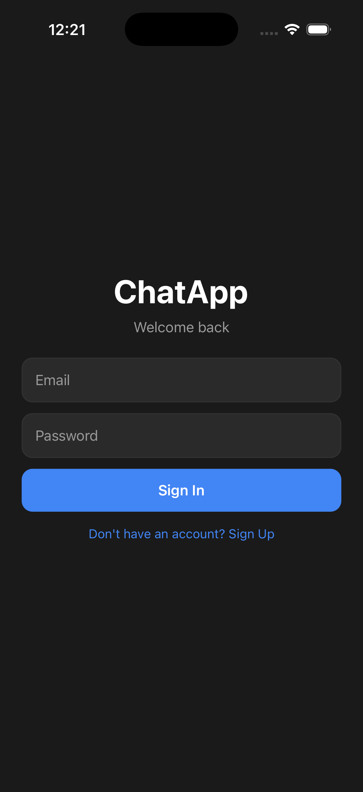
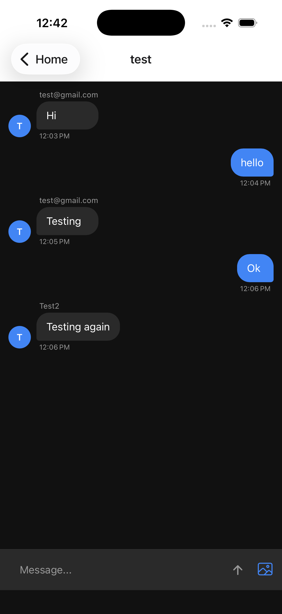
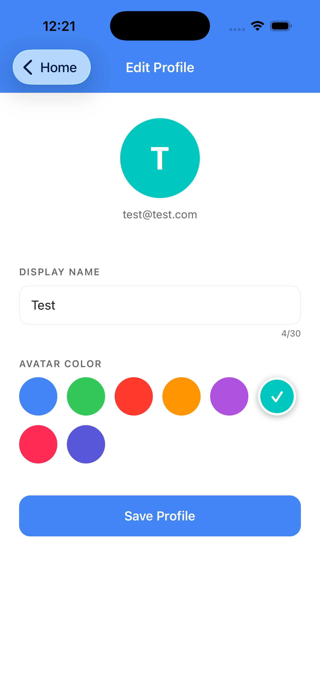

# ChatApp 💬

A production-ready real-time chat application built with React Native, demonstrating full-stack mobile development skills.

## Screenshots

| Login                           | Home                          | Chat                          |
| ------------------------------- | ----------------------------- | ----------------------------- |
|  |  |  |

| Dark Mode                               | Dark Mode Chat                                    | Profile                             |
| --------------------------------------- | ------------------------------------------------- | ----------------------------------- |
|  |  |  |

## Features

- 🔐 Email/Password Authentication (Firebase Auth)
- 💬 Real-time messaging (Socket.io)
- 👥 Group chat rooms + private 1-on-1 chat
- 🟢 Online/offline presence indicators
- 🌙 Dark mode support (system-aware)
- 🖼 Image sharing in chat
- 💾 Message persistence (Firestore)
- ⌨️ Typing indicators
- 🕐 Message timestamps
- 📱 Cross-platform (iOS + Android)

## Tech Stack

### Frontend

| Technology          | Purpose                         |
| ------------------- | ------------------------------- |
| React Native (Expo) | Cross-platform mobile framework |
| TypeScript          | Type safety                     |
| React Navigation    | Screen navigation               |
| Firebase JS SDK     | Auth + Firestore                |
| Socket.io Client    | Real-time messaging             |
| Expo Image Picker   | Image sharing                   |

### Backend

| Technology             | Purpose          |
| ---------------------- | ---------------- |
| Node.js + Express      | HTTP server      |
| Socket.io              | WebSocket server |
| Deployed on Render.com | Cloud hosting    |

### Database & Auth

| Service                 | Purpose                        |
| ----------------------- | ------------------------------ |
| Firebase Authentication | User management                |
| Cloud Firestore         | Message persistence + presence |

## Architecture

```
┌─────────────────┐     WebSocket      ┌──────────────────┐
│  React Native   │◄──────────────────►│  Node.js Server  │
│     Client      │                    │   (Socket.io)    │
└────────┬────────┘                    │   Render.com     │
         │                             └──────────────────┘
         │ Firebase SDK
         ▼
┌─────────────────┐
│    Firebase     │
│  Auth           │
│  Firestore DB   │
└─────────────────┘
```

## Project Structure

```
src/
├── screens/
│   ├── LoginScreen.tsx       # Auth with email/password
│   ├── HomeScreen.tsx        # Room list + online users
│   └── ChatScreen.tsx        # Real-time chat UI
├── navigation/
│   └── AppNavigator.tsx      # Stack navigation + auth guard
├── hooks/
│   └── useTheme.ts           # Dark/light mode hook
├── services/
│   └── firebase.ts           # Firebase config + helpers
└── types/
    └── index.ts              # TypeScript interfaces

backend/
└── server.js                 # Express + Socket.io server
```

## Getting Started

### Prerequisites

- Node.js 18+
- Expo CLI
- Firebase account

### Installation

```bash
# Clone the repo
git clone https://github.com/shubhi021/chat-app-rn.git
cd chat-app-rn

# Install dependencies
npm install

# Create environment file
cp .env.example .env
# Fill in your Firebase values in .env
```

### Environment Variables

Create a `.env` file in the root:

```
EXPO_PUBLIC_FIREBASE_API_KEY=your_api_key
EXPO_PUBLIC_FIREBASE_AUTH_DOMAIN=your_auth_domain
EXPO_PUBLIC_FIREBASE_PROJECT_ID=your_project_id
EXPO_PUBLIC_FIREBASE_STORAGE_BUCKET=your_storage_bucket
EXPO_PUBLIC_FIREBASE_MESSAGING_SENDER_ID=your_sender_id
EXPO_PUBLIC_FIREBASE_APP_ID=your_app_id
```

### Run the app

```bash
# iOS
npx expo run:ios

# Android
npx expo run:android
```

### Run the backend locally

```bash
cd backend
npm install
node server.js
```

## Backend Repository

[chatapp-backend](https://github.com/shubhi021/chatapp-backend) — Node.js + Socket.io server deployed on Render.com

## Key Technical Decisions

**Why Firebase JS SDK over native Firebase?**
The JS SDK works without native linking, making it easier to maintain and cross-platform compatible. For this scale of app, the JS SDK provides all required features.

**Why Socket.io for real-time instead of Firestore listeners only?**
Socket.io handles the typing indicator and presence system with lower latency. Firestore handles persistence. Both work together — Socket.io for live events, Firestore for data storage.

**Why Expo over bare React Native?**
Expo significantly reduces setup complexity and handles native module linking automatically, allowing faster iteration.

## License

MIT
